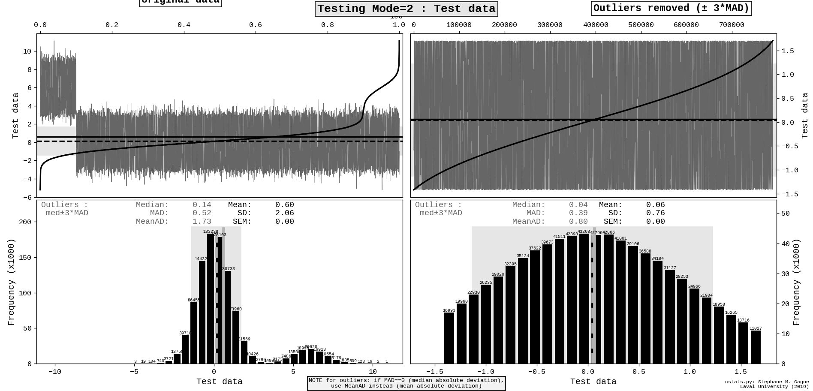

# cstats - Script to compute statistics for a chosen column in a file.

## Usage
Usage : cstats.py filename column# [column label] [GRAPH flag] [SAVE_TRIMMED_DATA flag]

Usage 1 (with filename) :
```
cstats.py filename column# [label] [graph?] [save trimmed data?]

  column# : 0 = first column
```
Usage 2 (with STDIN) :
```
cstats.py stdin column# [label] [graph?] [save trimmed data?] < filename
cat filename | cstats.py stdin # [label]
tail -n 100 filename | cstats.py stdin # [label]
    
    column# : 0 = first column
```

## Optional arguments
Optional third argument : label for the column
- if label is more than one word, or contains special characters, use single quotes : 'protein concentration (mM)'

Optional fourth argument : 0 (no graph) or 1 (graph, default)

Optional fifth argument : 0 (do not save trimmed data, default) or 1 (save trimmed data)

## Outliers
The program identifies and highlights potential outliers:
- Outliers are selected using the rule "median +/- 3* MAD", where MAD= Median Absolute Deviation
- Statistics for the trimmed data (without outliers) is provided for four rounds of trimming

## Output to terminal (6 columns):
```
[1] All data    [2-6] Trimmed data, round 1-5
    Count
    Min
    Max
    Mean
    StD (standard deviation with ddof=1)
    MeanAD (mean absolute deviation)
    SEM (standard error of the mean)
    ci95 (95% confidence interval for mean based on SEM)
    Median
    MAD (median absolute deviation)
    Skewness
    Kurtosis (normal Gaussian has kurtosis=0)
```
### Sample terminal output
```
                                                    Trim ±3*MAD 
                            -----------------------------------------------------------
                   All      Round 1      Round 2      Round 3      Round 4      Round 5
=======================================================================================
     Count:    1000000       789886       683798       615253       565600       527743
  Outliers:     210114       106088        68545        49653        37857        30627
       Min:    -5.2050      -1.4188      -1.1321      -0.9789      -0.8784      -0.8062
       Max:    11.1291       1.7033       1.2198       1.0250       0.9081       0.8274
---------------------------------------------------------------------------------------
      Mean:     0.6021       0.0608       0.0277       0.0167       0.0115       0.0086
       StD:     2.0601       0.7606       0.6173       0.5400       0.4883       0.4506
    MeanAD:     1.7346       0.7959       0.6554       0.5767       0.5231       0.4838
       SEM:     0.0021       0.0009       0.0007       0.0007       0.0006       0.0006
    ci95 ±:     0.0040       0.0017       0.0015       0.0013       0.0013       0.0012
---------------------------------------------------------------------------------------
    Median:     0.1422       0.0439       0.0230       0.0149       0.0106       0.0082
       MAD:     0.5204       0.3920       0.3340       0.2978       0.2723       0.2529
---------------------------------------------------------------------------------------
  Skewness:       1.78         0.09         0.03         0.01         0.01         0.00
  Kurtosis:       2.99        -0.84        -1.00        -1.06        -1.09        -1.10
---------------------------------------------------------------------------------------
```

## Graphical output :
- Histogram with mean and median
- For all data point and for trimmed data points (without outliers)

### Sample graphical output

## Versions
Written by Stephane M. Gagne, Laval University, Canada  
(Replacement for my old 2004 "stats1" awk script)  

v. 0.1.1 (2019-09-19) :  
- rewrote some code (more compact)
- improved comments
- added # of outliers to console output

v. 0.1.0 (2019-09-15) :  
 - Initial version

