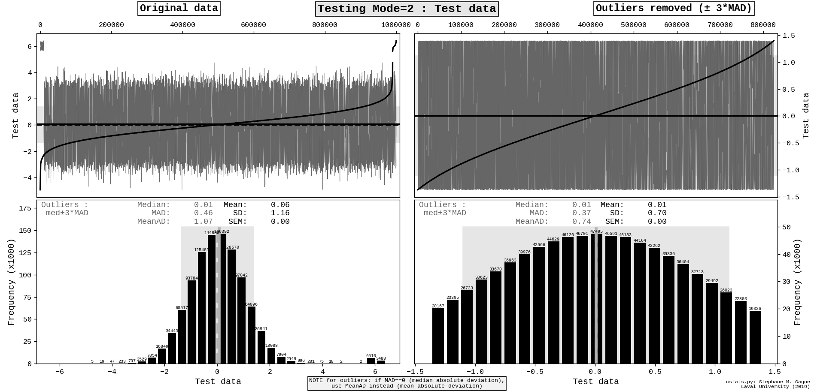

# cstats - Script to compute statistics for a chosen column in a file.

## Usage
Usage : cstats.py filename column# [column label] [GRAPH flag] [SAVE_TRIMMED_DATA flag]

Usage 1 (with filename) :
```
cstats.py filename column# [label] [graph?] [save trimmed data?]

  column# : 0 = first column
```
Usage 2 (with STDIN) :
```
cstats.py stdin column# [label] [graph?] [save trimmed data?] < filename
cat filename | cstats.py stdin # [label]
tail -n 100 filename | cstats.py stdin # [label]
    
    column# : 0 = first column
```

## Optional arguments
Optional third argument : label for the column
- if label is more than one word, or contains special characters, use single quotes : 'protein concentration (mM)'

Optional fourth argument : 0 (no graph) or 1 (graph, default)

Optional fifth argument : 0 (do not save trimmed data, default) or 1 (save trimmed data)

## Outliers
The program identifies and highlights potential outliers:
- Outliers are selected using the rule "median +/- 3* MAD", where MAD= Median Absolute Deviation
- Statistics for the trimmed data (without outliers) is provided for four rounds of trimming

## Output to terminal (6 columns):
```
[1] All data    [2-6] Trimmed data, round 1-5
    Count
    Min
    Max
    Mean
    StD (standard deviation with ddof=1)
    MeanAD (mean absolute deviation)
    SEM (standard error of the mean)
    ci95 (95% confidence interval for mean based on SEM)
    Median
    MAD (median absolute deviation)
    Skewness
    Kurtosis (normal Gaussian has kurtosis=0)
```
### Sample terminal output
```
                                                    Trim ±3*MAD 
                            -----------------------------------------------------------
                   All      Round 1      Round 2      Round 3      Round 4      Round 5
=======================================================================================
     Count:    1000000       824245       724520       657156       607742       569829
  Outliers:     175755        99725        67364        49414        37913        30707
       Min:    -4.5386      -1.3681      -1.1031      -0.9595      -0.8659      -0.7984
       Max:     6.4439       1.3930       1.1119       0.9634       0.8674       0.7984
---------------------------------------------------------------------------------------
      Mean:     0.0600       0.0058       0.0023       0.0008      -0.0002      -0.0007
       StD:     1.1602       0.6998       0.5881       0.5214       0.4754       0.4415
    MeanAD:     1.0660       0.7377       0.6260       0.5575       0.5097       0.4742
       SEM:     0.0012       0.0008       0.0007       0.0006       0.0006       0.0006
    ci95 ±:     0.0023       0.0015       0.0014       0.0013       0.0012       0.0011
---------------------------------------------------------------------------------------
    Median:     0.0124       0.0044       0.0020       0.0008      -0.0000      -0.0005
       MAD:     0.4602       0.3692       0.3205       0.2889       0.2661       0.2487
---------------------------------------------------------------------------------------
  Skewness:       1.23         0.01         0.00         0.00        -0.00        -0.00
  Kurtosis:       5.53        -0.93        -1.02        -1.07        -1.09        -1.11
---------------------------------------------------------------------------------------
```

## Graphical output :
- Histogram with mean and median
- For all data point and for trimmed data points (without outliers)

### Sample graphical output

## Versions
Written by Stephane M. Gagne, Laval University, Canada  
(Replacement for my old 2004 "stats1" awk script)  

v. 0.1.1 (2019-09-19) :  
- rewrote some code (more compact)
- improved comments
- added # of outliers to console output

v. 0.1.0 (2019-09-15) :  
 - Initial version

